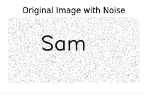
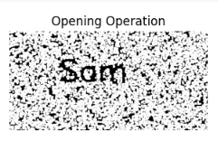
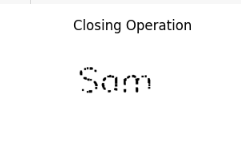

# OPENING--AND-CLOSING
## Aim
To implement Opening and Closing using Python and OpenCV.

## Software Required
1. Anaconda - Python 3.7
2. OpenCV
## Algorithm:
### Step1:
Create a white image of specified size and add black text ("Sam") to it using cv2.putText.
### Step2:
Add random salt-and-pepper noise to the image by setting random pixels to black or white.
### Step3:
Create a smaller structuring element (kernel) of size 5x5 using `np.ones()`.
### Step4:
Apply the Opening operation using `cv2.morphologyEx()` with erosion followed by dilation.
### Step5:
Apply the Closing operation using `cv2.morphologyEx()` with dilation followed by erosion.
## Program:
```md
Name : Sam Israel D
Reg. No : 212222230128
```
``` Python
import cv2
import numpy as np
from matplotlib import pyplot as plt

# Step 1: Create a binary image (for demonstration, we'll create an image with text 'Sam')
img = np.ones((300, 600), dtype="uint8") * 255  # Create a white image
cv2.putText(img, 'Sam', (150, 150), cv2.FONT_HERSHEY_SIMPLEX, 3, (0, 0, 0), 5)  # Add black text 'Sam'

# Step 2: Add random noise (salt and pepper) to the image to make the effect more visible
noise = np.random.rand(*img.shape)
img[noise < 0.05] = 0  # Random black pixels (salt)
img[noise > 0.95] = 255  # Random white pixels (pepper)

# Step 3: Create a smaller structuring element (kernel) for subtle effects
kernel = np.ones((5, 5), np.uint8)  # A smaller 5x5 square kernel

# Step 4: Apply the Opening operation (erosion followed by dilation)
opening = cv2.morphologyEx(img, cv2.MORPH_OPEN, kernel)

# Step 5: Apply the Closing operation (dilation followed by erosion)
closing = cv2.morphologyEx(img, cv2.MORPH_CLOSE, kernel)

# Step 6: Display the results using matplotlib for better visualization
plt.figure(figsize=(12, 8))

# Original image with noise
plt.subplot(1, 3, 1)
plt.title('Original Image with Noise')
plt.imshow(img, cmap='gray')
plt.axis('off')

# Opening image
plt.subplot(1, 3, 2)
plt.title('Opening Operation')
plt.imshow(opening, cmap='gray')
plt.axis('off')

# Closing image
plt.subplot(1, 3, 3)
plt.title('Closing Operation')
plt.imshow(closing, cmap='gray')
plt.axis('off')

plt.show()
```
## Output:

### Display the input Image&nbsp;&nbsp;&nbsp;&nbsp;&nbsp;&nbsp;&nbsp;&nbsp;&nbsp;&nbsp;&nbsp;&nbsp;&nbsp;&nbsp;&nbsp;&nbsp;&nbsp;Display the result of Opening
&nbsp;&nbsp;&nbsp;&nbsp;&nbsp;&nbsp;&nbsp;&nbsp;&nbsp;&nbsp;&nbsp;&nbsp;&nbsp;&nbsp;&nbsp;&nbsp;&nbsp;&nbsp;
### &nbsp;&nbsp;&nbsp;&nbsp;&nbsp;&nbsp;&nbsp;&nbsp;&nbsp;&nbsp;&nbsp;&nbsp;&nbsp;&nbsp;&nbsp;&nbsp;&nbsp;&nbsp;&nbsp;&nbsp;&nbsp;&nbsp;&nbsp;&nbsp;&nbsp;&nbsp;&nbsp;&nbsp;&nbsp;&nbsp;&nbsp;&nbsp;&nbsp;&nbsp;&nbsp;&nbsp;Display the result of Closing
&nbsp;&nbsp;&nbsp;&nbsp;&nbsp;&nbsp;&nbsp;&nbsp;&nbsp;&nbsp;&nbsp;&nbsp;&nbsp;&nbsp;&nbsp;&nbsp;&nbsp;&nbsp;&nbsp;&nbsp;&nbsp;&nbsp;&nbsp;&nbsp;&nbsp;&nbsp;&nbsp;&nbsp;&nbsp;&nbsp;&nbsp;&nbsp;&nbsp;&nbsp;&nbsp;&nbsp;&nbsp;&nbsp;&nbsp;&nbsp;&nbsp;&nbsp;&nbsp;&nbsp;&nbsp;&nbsp;&nbsp;
## Result
Thus, the Opening and Closing operation is used in the image using python and OpenCV.
